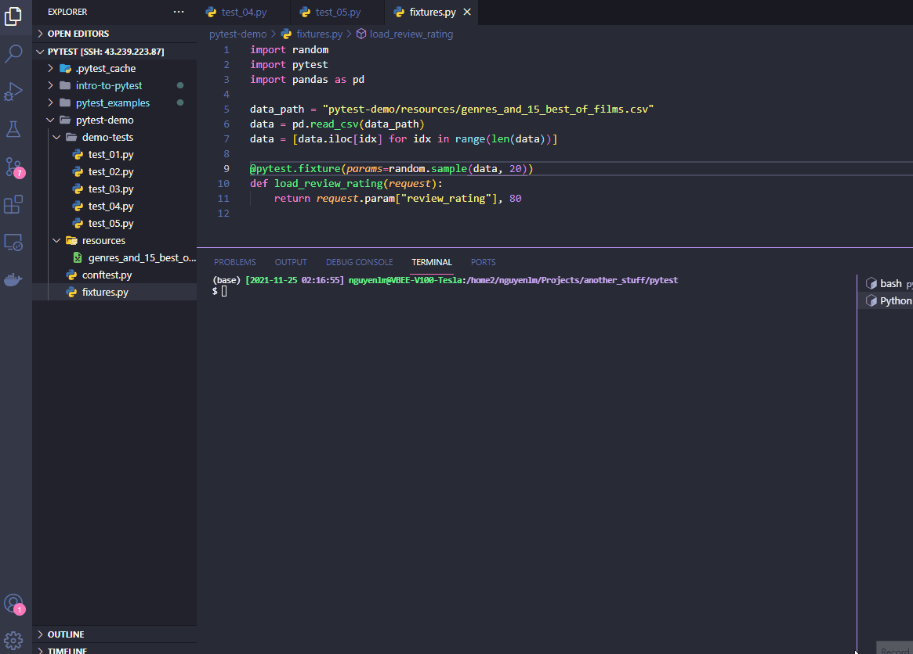

# PyTest Talk
This talk give you some ideals about the purpose of unittest? how to write good unittest? how to use `pytest` framework? and show you the basic unittest structure for your project.
 


## Folder Structure

```sh
.
├── demo-tests
│   ├── test_01.py
│   ├── test_02.py
│   ├── test_03.py
│   ├── test_04.py
│   └── test_05.py
├── function_to_tests
├── resources
│   ├── genres_and_15_best_of_films.csv
│   └── pytest_demo_running.gif
├── tests
│    └── test_basic.py
├── conftest.py
├── fixtures.py
├── README.md
├── requirements.txt
```

- `demo-tests`: contains demo unittests for this talk (safety to ignore in your project )
- `function_to_tests`: contains your functions which need to be tested
- `resources`: contains static files for the unittest
- `tests`: contains your real unittest in your project
- `conftest.py`: the `pytest` will find all user's fixtures from here
- `fixture.py`: defining your fixtures

## Installation

```sh
$ pip install -r requirements.txt
```

## Pytest Configs

```sh
$ pytest [option] test_file|test_folder

# -s (print all string output)
# -v (print names of individual tests as they run)
# -x (stop at first failure)
# -k (only run tests matching following keywords)

```

## Run Unittest Demo

```

```sh
$ pytest pytest-demo/demo-tests
```

## Reference

[1] [Htorrence - PyData Unit Test Talk 2018](https://github.com/htorrence/pytest_examples)

[2] [Pluralsight - Intro To Pytest](https://github.com/pluralsight/intro-to-pytest)

[3] [Pytest Framework](https://github.com/pytest-dev/pytest)

[4] [pytest-sugar plugin](https://github.com/Teemu/pytest-sugar)

